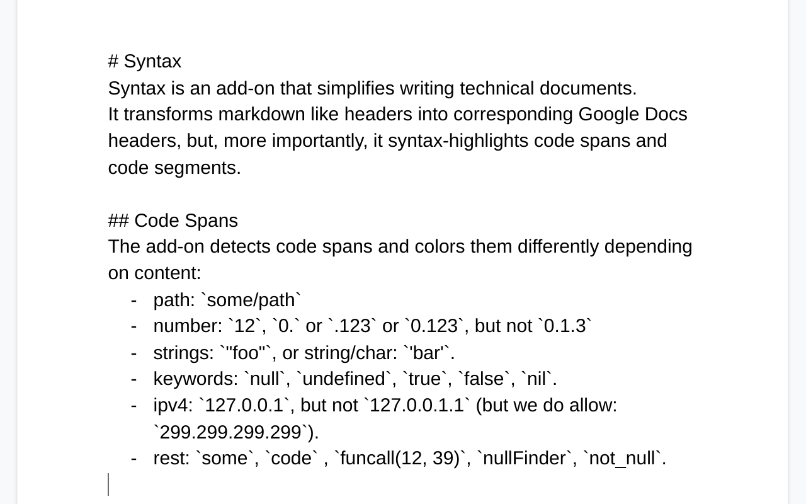
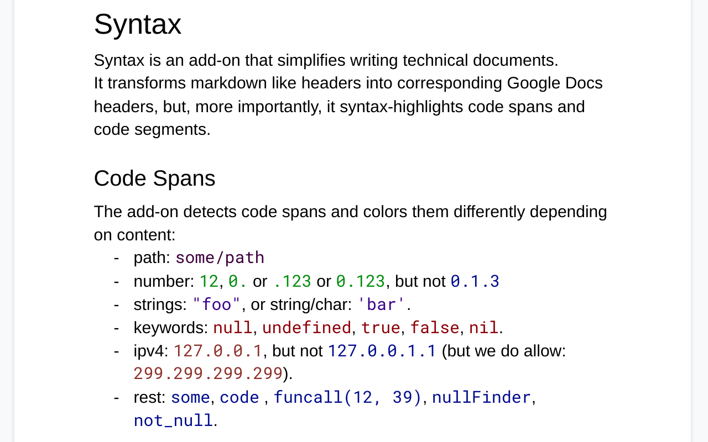
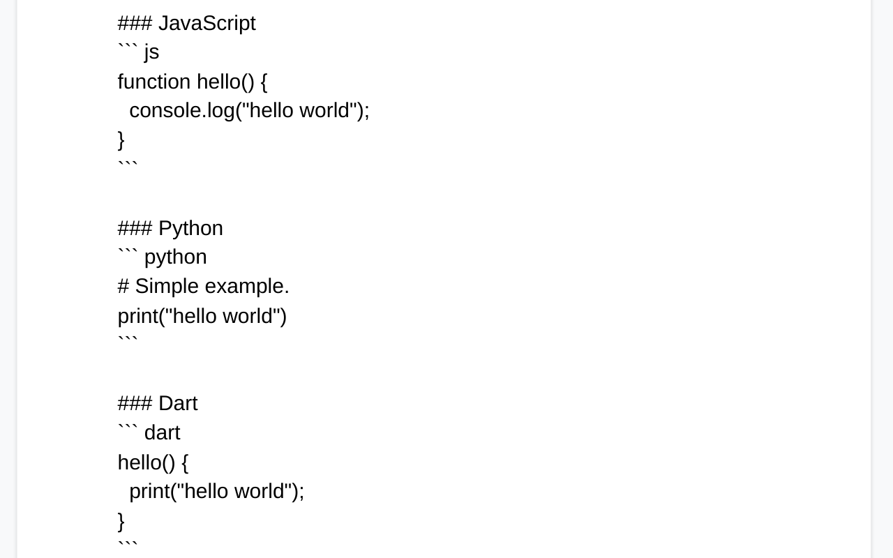
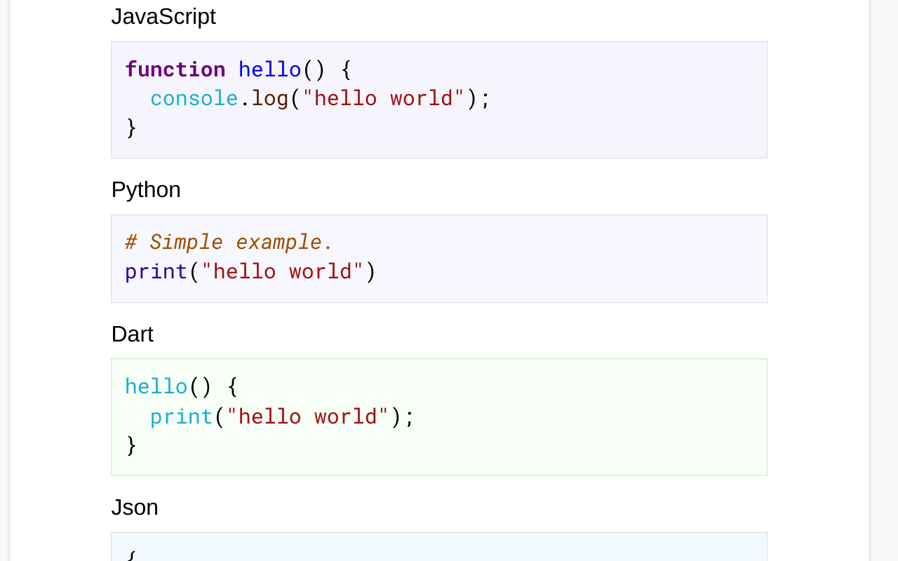
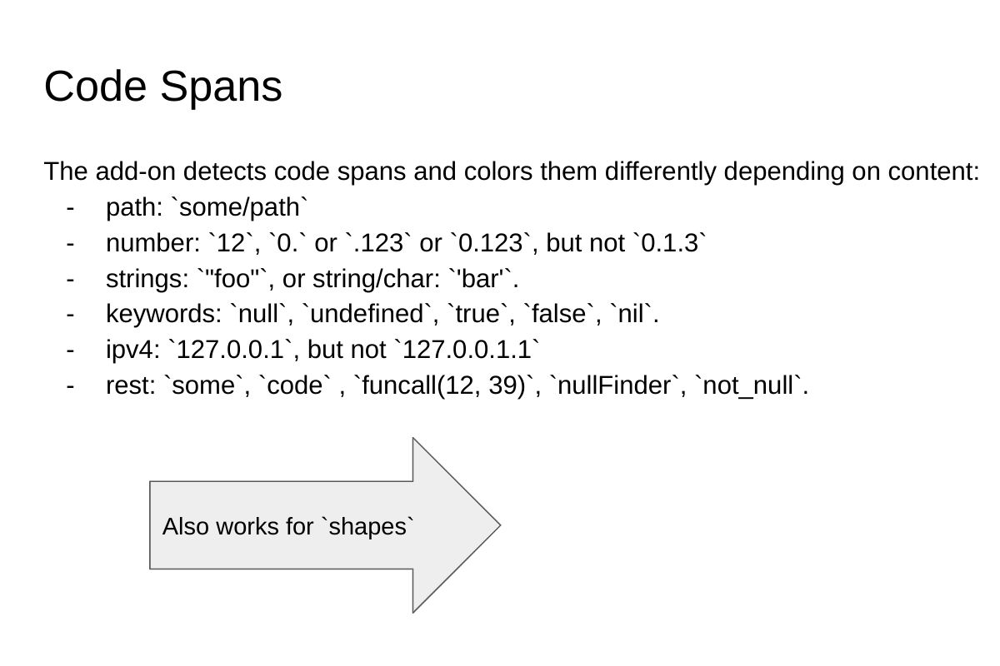
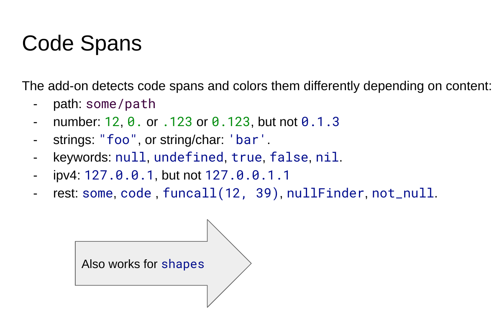
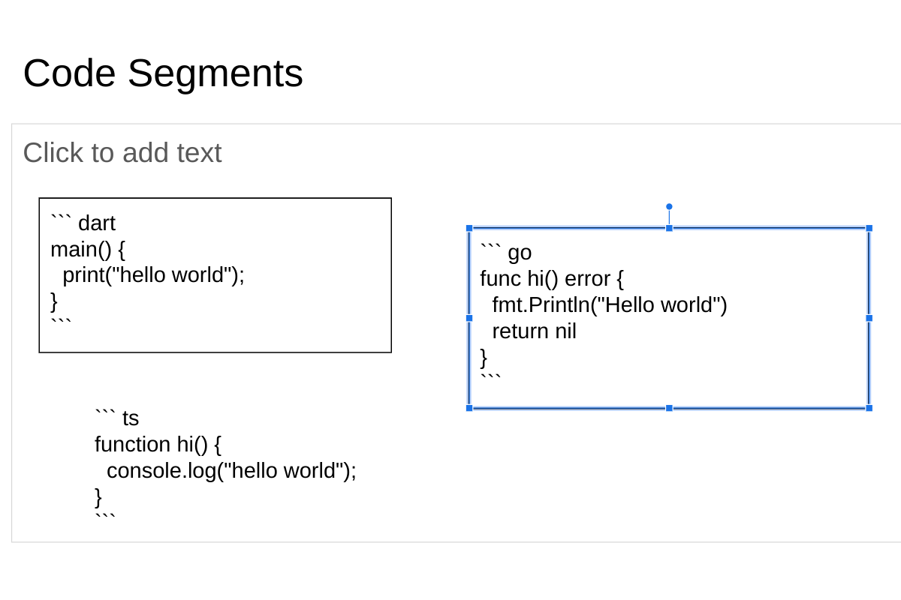
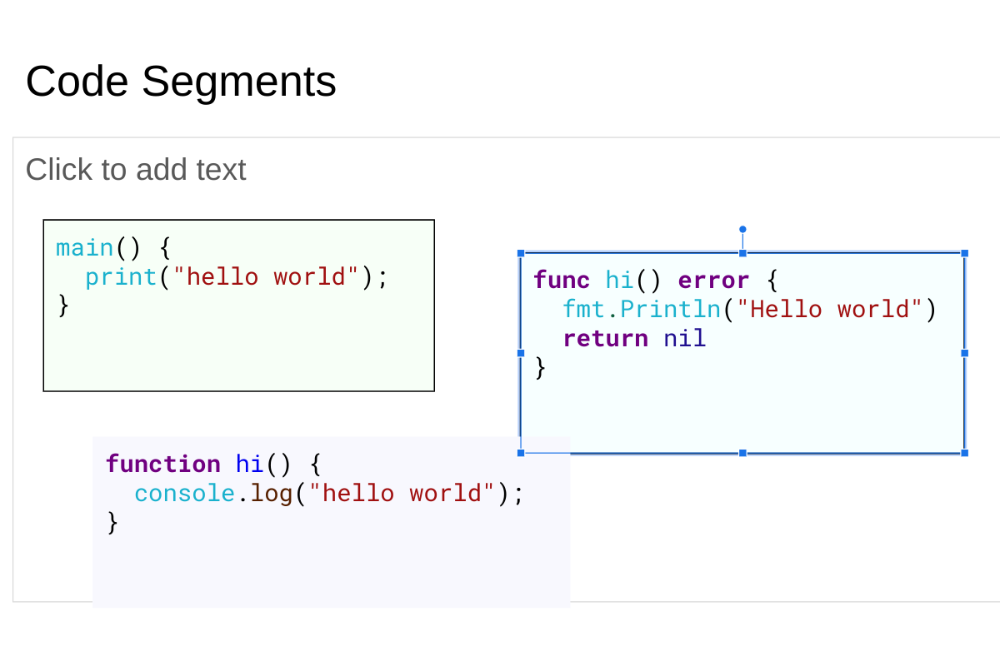

# Google Docs/Slides Add-On for Syntax Highlighting
Add-ons for Google Docs and Slides to highlight code segments and code spans.

## Installation
The add-on is published on the Google Workspace Marketplace, and can be
installed from [there](https://workspace.google.com/marketplace/app/code_syntax/827674971433).

## Help
See the [support](https://code-syntax-addon.github.io/code-syntax) page
for help and troubleshooting.

## Google Docs Examples
Before | After
------ | -----
 | 
 | 

## Google Slides Examples
Before | After
------ | -----
 | 
 | 

## Themes
See the [theme gallery](https://code-syntax-addon.github.io/code-syntax/theme-gallery.html) for
examples of themes.

If you want to contribute a [theme](https://code-syntax-addon.github.io/code-syntax/themes.html),
please create a pull request on the `gh-pages` branch.

## Testing

See the [test documentation](tests/README.md) for local regression tests and
the end-to-end smoke-test procedure.

## Kodify
This add-on was inspired by "Kodify", a google-docs extension that was
available at Google (go/kodify).

## License
All code is licensed MIT.

Note that the add-ons use [https://codemirror.net/](CodeMirror) (also
licensed MIT).
