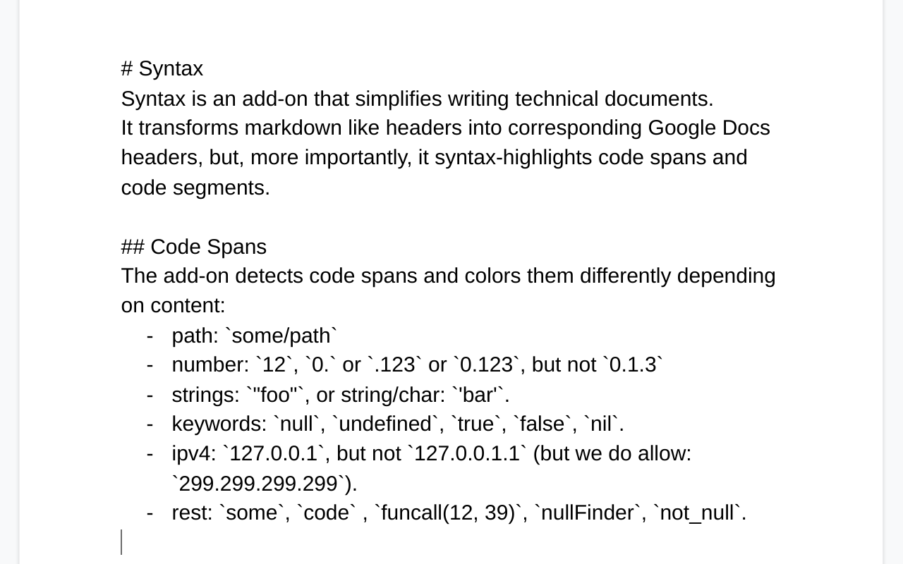

# Google Docs Add-On for Syntax Highlighting
This add-on provides support for code segments and code spans.

Similarly to markdown code segments are delimited with triple back-ticks and code spans with single back-ticks:
~~~
```
A code segment.
```
And a `code` span.
~~~

Additionally, the add-on changes `# Heading` lines to their corresponding
Google Docs headings.

## Examples
Before | After
------ | -----
 | 
 | 

## Compilation/Upload
Use `clasp` to compile and upload.

```
clasp login
clasp status
clasp push
```

The script id is stored in .clasp.json.

Note: we now depend on codemirror library, and a theme library.
The dependencies are written into the appsscript.json.

## Limitations of Google Apps Script
GAS comes with some limitations which guided the design of this add-on.

### Paragraph Background
There is no nice way to change the background color of a paragraph using "normal"
GAS (see the [back](reference)). One can use the `batchUpdate` calls (see [batch0](reference), [batch1](stackoverflow question), and [batch2](another stackoverflow
question)) to change the paragraphs, but that comes with two severe annoyances:
* the script needs more permissions. (There is no way to get API permissions
  for just the one document).
* UNDO doesn't work for API calls.

As a consequence we wrap code segments into a table.

[back]: https://developers.google.com/apps-script/reference/document/attribute

[batch0]: https://developers.google.com/docs/api/reference/rest/v1/documents/batchUpdate
[batch1]: https://stackoverflow.com/a/60423698
[batch2]: https://stackoverflow.com/questions/60432342

### Table Indentation
There is no way to change the indentation of a table.

As a consequence we move code segments that should be indented into another
"hidden" table where the first invisible column gives some indentation.
