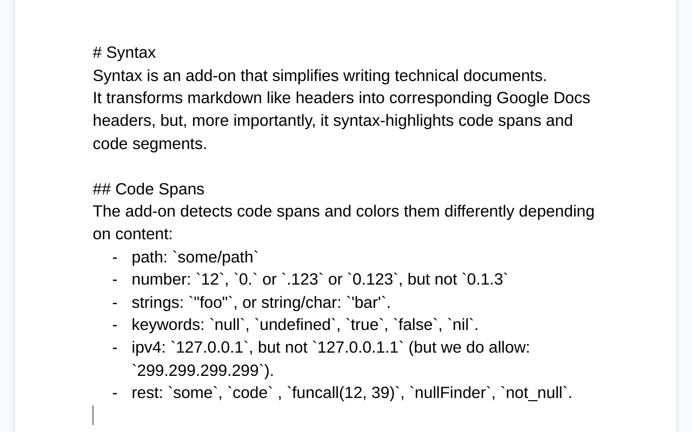
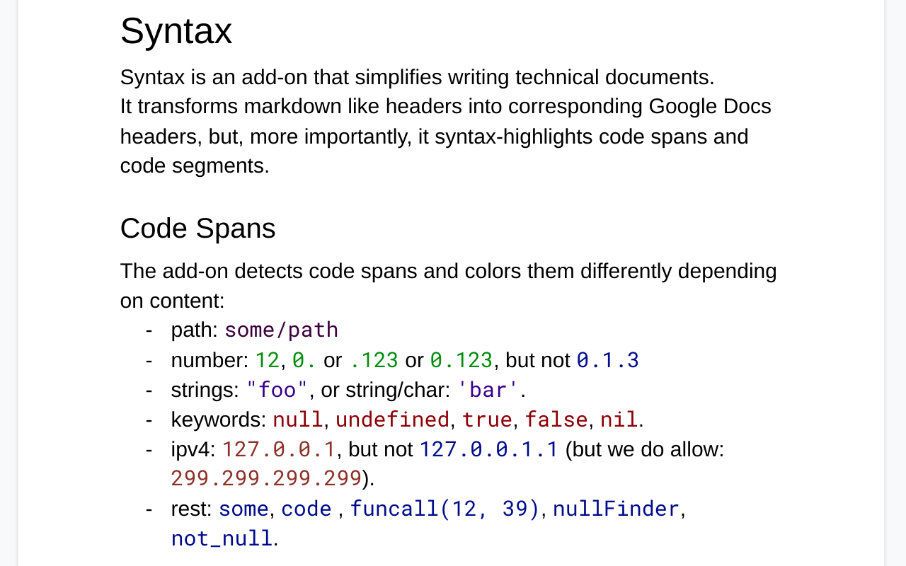
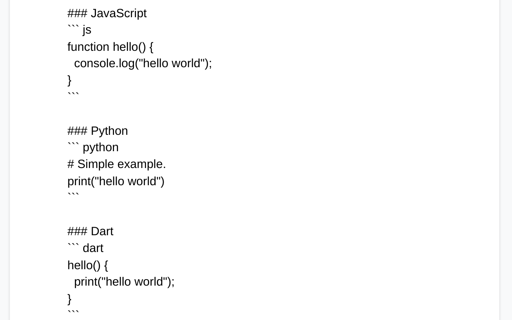
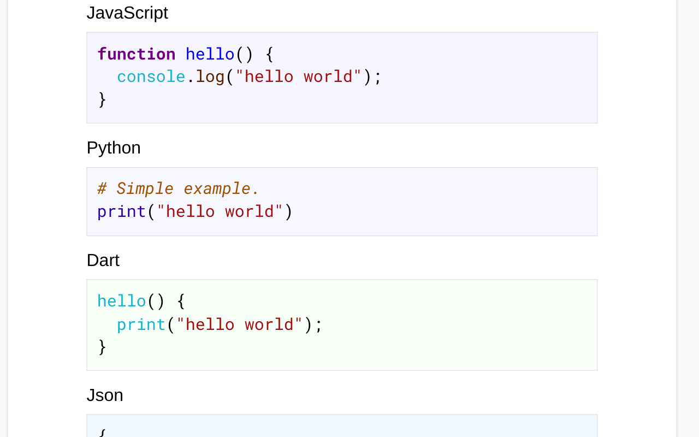
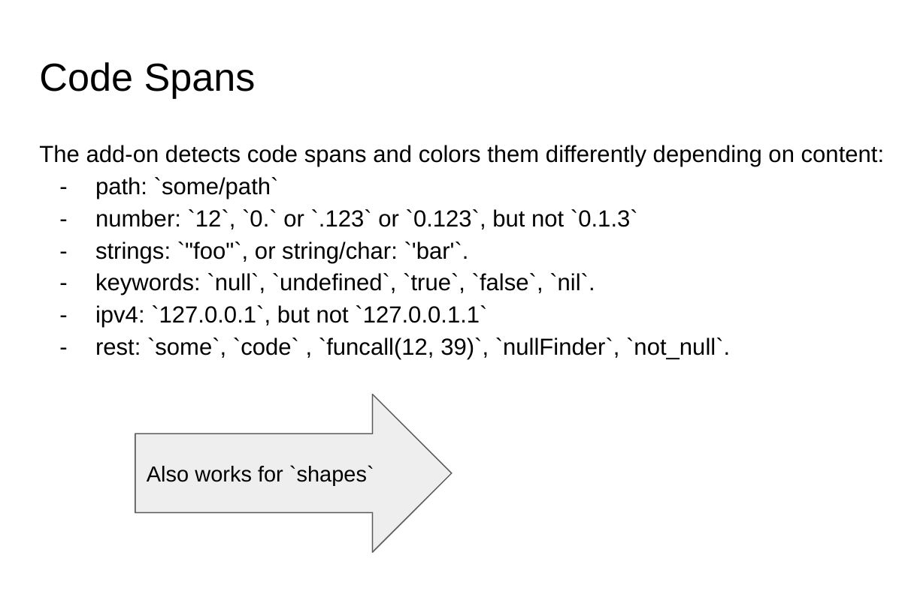
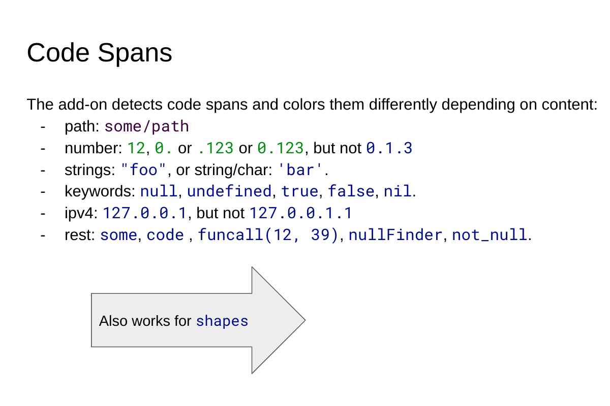
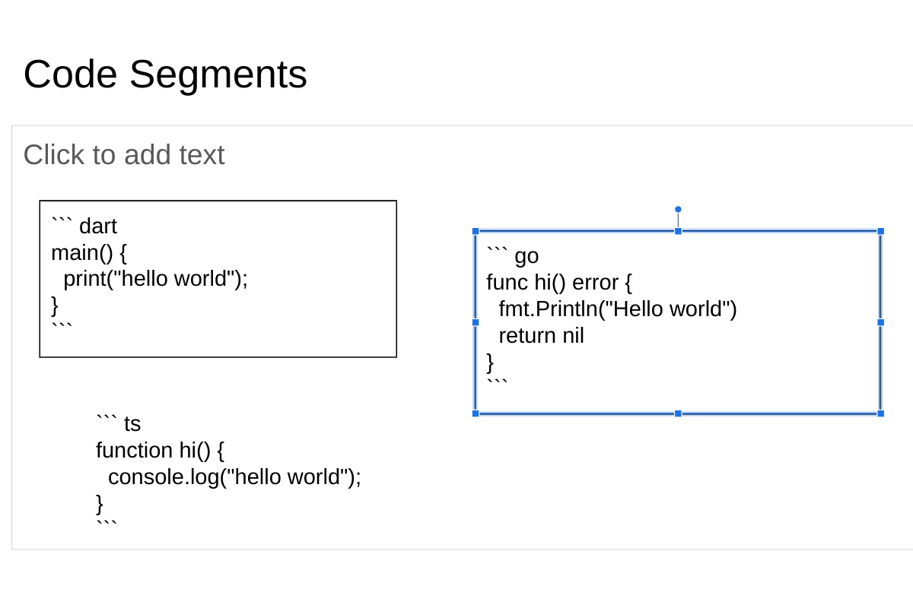
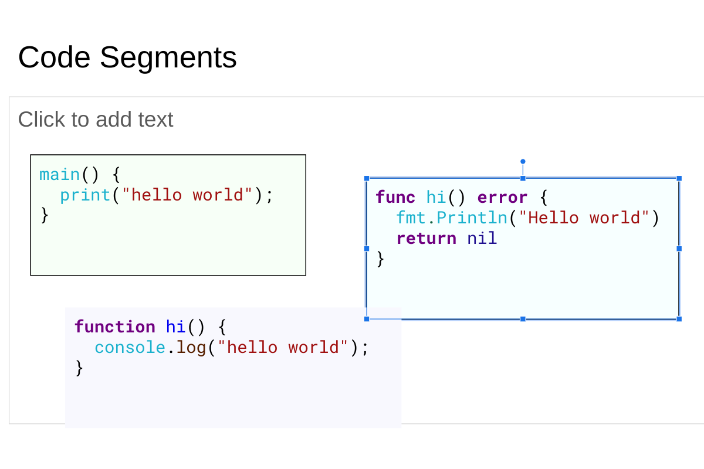

# Google Docs/Slides Add-On for Syntax Highlighting
Add-ons for Google Docs and Slides to highlight code segments and code spans.

## Installation
The add-on is published on the Google Workspace Marketplace, and can be
installed from [there](https://workspace.google.com/marketplace/app/code_syntax/827674971433).

## Google Docs Examples
Before | After
------ | -----
 | 
 | 

## Google Slides Examples
Before | After
------ | -----
 | 
 | 

## Kodify
This add-on was inspired by "Kodify", a google-docs extension that was
available at Google (go/kodify).

## Privacy Policy
This add-on does not collect any personal information, but for
completeness, a [privacy policy](privacy-policy.html) is provided.

## Support
See the [support page](support.html) for more information.

## License
All code is licensed MIT.

Note that the add-ons use [https://codemirror.net/](CodeMirror) (also
licensed MIT).
