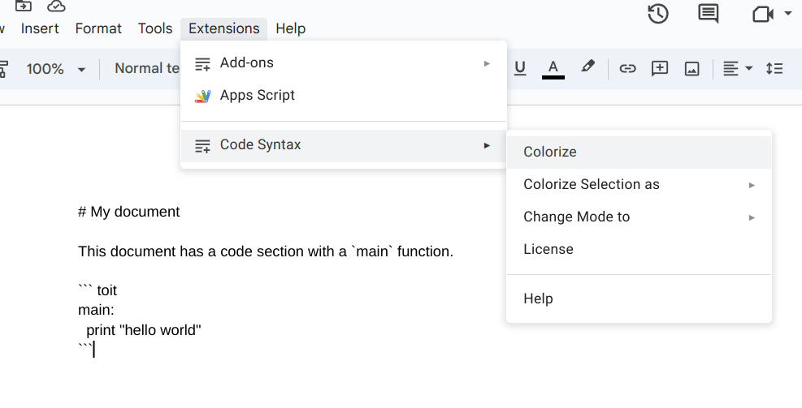

# Support Guide

Development of this add-on is done on GitHub. Please
[open an issue](https://github.com/code-syntax-addon/code-syntax/issues)
if you have any questions or suggestions.

## Google Docs

The Code Syntax add-on for Google Docs allows you to write
code in Markdown and have it syntax-highlighted.

---

### Menu Items

There are three primary functions accessible from the add-on menu:

1. **Colorize**
2. **Colorize selection as**
3. **Change mode to**

---

#### Colorize

"Colorize" processes the entire document, seeking sections enclosed
in backticks (`).

* Single backtick: If a section of text is enclosed in a single backtick,
  the add-on changes the format to "code" (monospace font), providing it
  with a distinct appearance. For example, in the sentence
  "In this text `these three words`", "these three words" would be
  formatted to appear as code.

* Triple backticks: If a section of text is enclosed in triple backticks,
  the add-on syntax-highlights the enclosed text according to the specified
  programming language. Note that the add-on ignores code blocks where
  it doesn't recognize the programming language, so that the user has a chance
  to fix the specified language.

The add-on also converts '#' to Google Docs headers, depending on the
number of '#' used (for example, '#', '##', '###').

Example:

|------ | -----|
| | |

---

The add-on uses the background color of the generated code blocks to
remember the programming language of the code block. If you run
"Colorize" again, it will use this information to re-colorize the
code blocks according to the remembered language.

#### Colorize selection as

"Colorize selection as" allows you to manually select a piece of
text and colorize it as a code segment in a specific language.
You can use this feature to highlight your code snippets with
appropriate syntax coloring.

To use it, simply select a text and then go to the add-on menu,
choose "Colorize selection as" and pick the desired programming language.

Note that the syntax highlighting is done without adding a background box.
Future calls to `Colorize` will not affect the selected text. If you
change the code, you need to re-colorize the selection.

Example:

|------ | -----|
| | |

---

#### Change mode to

"Change mode to" modifies the syntax highlighting of a rendered code
section where the cursor is currently located.

For example, say you wrote a code section without specifying the
programming language, and it was rendered as plain text:

|------ | -----|
| | |


If you now want to change the highlighting to Python, proceed as follows:
- Place your cursor in the rendered code section block.
- Navigate to the add-on menu and choose "Change mode to" -> "Python".

|------ | -----|
| | |

This menu option does nothing if the cursor is not in a code section.

## Google Slides

The Code Syntax add-on for Google Slides allows you to write
code in Markdown and have it syntax-highlighted.

**Note:** code blocks in Google Slides only work on full
text boxes. That is, there is no way to have a code block
in the middle of a text box. A code section is only recognized
as such if the text box starts with ``` and ends with ```.

---

### Menu Items

There are four primary functions accessible from the add-on menu:

1. **Colorize**
1. **Colorize Slide**
2. **Colorize selection as**
3. **Change mode to**

---

#### Colorize and Colorize Slide

"Colorize" processes the entire document, seeking text boxes for
code spans and code sections. "Colorize Slide" does the same, but
only for the current slide.

* Code spans: If a section of text is enclosed in a single backtick,
  the add-on changes the format to "code" (monospace font), providing it
  with a distinct appearance. For example, in the sentence
  "In this text `these three words`", "these three words" would be
  formatted to appear as code.

* Code sections: If a text box starts with ``` and ends with ``` it is
  recognized as a code section. The add-on changes the text box to a
  code block and syntax-highlights the enclosed text according to the
  specified programming language. Note that the add-on ignores code
  blocks where it doesn't recognize the programming language, so that
  the user has a chance to fix the specified language.

Example:

|------ | -----|
| | |

---

The add-on uses the background color of the generated code blocks to
remember the programming language of the code block. If you run
"Colorize" again, it will use this information to re-colorize the
code blocks according to the remembered language.

#### Colorize selection as

"Colorize selection as" allows you to manually select a piece of
text and colorize it as a code segment in a specific language.
You can use this feature to highlight your code snippets with
appropriate syntax coloring.

To use it, simply select a text and then go to the add-on menu,
choose "Colorize selection as" and pick the desired programming language.

Note that the syntax highlighting is done without adding a background box.
Future calls to `Colorize` or `Colorize Slide` will not affect the selected
text. If you change the code, you need to re-colorize the selection.

Example:

|------ | -----|
| | |

---

#### Change mode to

"Change mode to" modifies the syntax highlighting of a rendered code
section where the cursor is currently located.

For example, say you wrote a code section without specifying the
programming language, and it was rendered as plain text:

|------ | -----|
| | |


If you now want to change the highlighting to Python, proceed as follows:
- Place your cursor in the rendered code section block.
- Navigate to the add-on menu and choose "Change mode to" -> "Python".

|------ | -----|
| | |

This menu option does nothing if the cursor is not in a code section.
