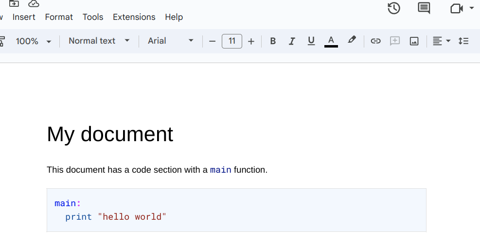

# Support Guide

## Google Docs

The Code Syntax add-on for Google Docs brings the power of code
syntax highlighting directly to your Google Docs. It supports
several programming languages, allowing you to seamlessly add
code snippets to your documents in a visually appealing manner.

---

### Menu Items

There are three primary functions accessible from the add-on menu:

1. **Colorize**
2. **Colorize selection as**
3. **Change mode to**

---

#### Colorize

"Colorize" processes the entire document, seeking sections enclosed
in backticks (`).

* Single backtick: If a section of text is enclosed in a single backtick,
  the add-on changes the format to "code" (monospace font), providing it
  with a distinct appearance. For example, in the sentence
  "In this text `these three words`", "these three words" would be
  formatted to appear as code.

* Triple backticks: If a section of text is enclosed in triple backticks,
  the add-on syntax-highlights the enclosed text according to the specified
  programming language. Note that the add-on ignores code blocks where
  it doesn't recognize the programming language, so that the user has a chance
  to fix the specified language.

The add-on also converts '#' to Google Docs headers, depending on the
number of '#' used (for example, '#', '##', '###').

Example:

|------ | -----|
| | |

---

#### Colorize selection as

"Colorize selection as" allows you to manually select a piece of
text and colorize it as a code segment in a specific language.
You can use this feature to highlight your code snippets with
appropriate syntax coloring.

To use it, simply select a text and then go to the add-on menu,
choose "Colorize selection as" and pick the desired programming language.

Note that the syntax highlighting is done without adding a background box.
Future calls to `Colorize` will not affect the selected text. If you
change the code, you need to re-colorize the selection.

Example:

|------ | -----|
| | |

---

#### Change mode to

"Change mode to" modifies the syntax highlighting of a rendered code
section where the cursor is currently located.

For example, say you wrote a code section without specifying the
programming language, and it was rendered as plain text:

|------ | -----|
| | |

If you now want to change the highlighting to Python, proceed as follows:
- Place your cursor in the rendered code section block.
- Navigate to the add-on menu and choose "Change mode to" -> "Python".

|------ | -----|
| | |

This menu option does nothing if the cursor is not in a code section.
