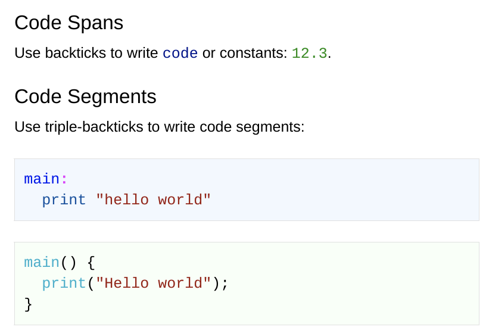
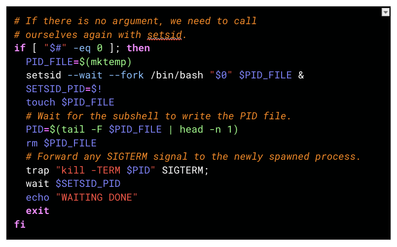
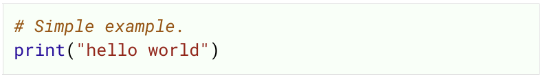

# Theme Gallery

This page contains a gallery of themes, together with their theme-string.

We encourage contributions as pull requests to the [GitHub repository](
  https://github.com/code-syntax-addon/code-syntax).

See the [Themes](themes.html) page for more information on how to create your own themes.

## Courier New

Overrides the default font for code to "Courier New".

```json
{
  "default": {
     "fontFamily": "Courier New"
  }
}
```



## Dark Shell

Changes the background color for the 'shell' mode to (almost) black,
and adjusts the default style and the codeMirror syntax highlighting rules.

```json
{
  "modes": {
    "shell": {
      "modeColor": "#000101",
      "style": {
        "foreground": "#ffffff"
      },
      "codeMirror": {
        "header": {
            "bold": true,
            "foreground": "#00ff00"
        },
        "quote": "#80ff80",
        "negative": "#ff4040",
        "positive": "#40ff40",
        "strong": {
            "bold": true
        },
        "em": {
            "italic": true
        },
        "keyword": {
            "bold": true,
            "foreground": "#ff80ff"
        },
        "atom": "#a0a0ff",
        "number": "#80ff80",
        "def": "#8080ff",
        "variable": "#40c8ff",
        "punctuation": "#70c0ff",
        "property": "#ff8c40",
        "operator": {
            "bold": true,
            "foreground": "#ff55ff"
        },
        "variable-2": "#80a0ff",
        "variable-3": "#40ff80",
        "type": "#40ff80",
        "comment": {
            "italic": true,
            "foreground": "#ff8000"
        },
        "string": "#ff4040",
        "string-2": "#ff7040",
        "meta": "#a0a0a0",
        "qualifier": "#a0a0a0",
        "builtin": "#8080ff",
        "bracket": "#c0c0a0",
        "tag": "#40ff40",
        "attribute": "#80c0ff",
        "hr": "#c0c0c0",
        "link": "#80c0ff",
        "error": "#ff2020",
        "invalidchar": "#ff2020"
      }
    }
  }
}
```



## Python with Green Background

Changes the background color for the 'python' mode to a light green.

```json
{
  "modes": {
    "python": {
      "modeColor": "#f7fff8"
    }
  }
}
```


